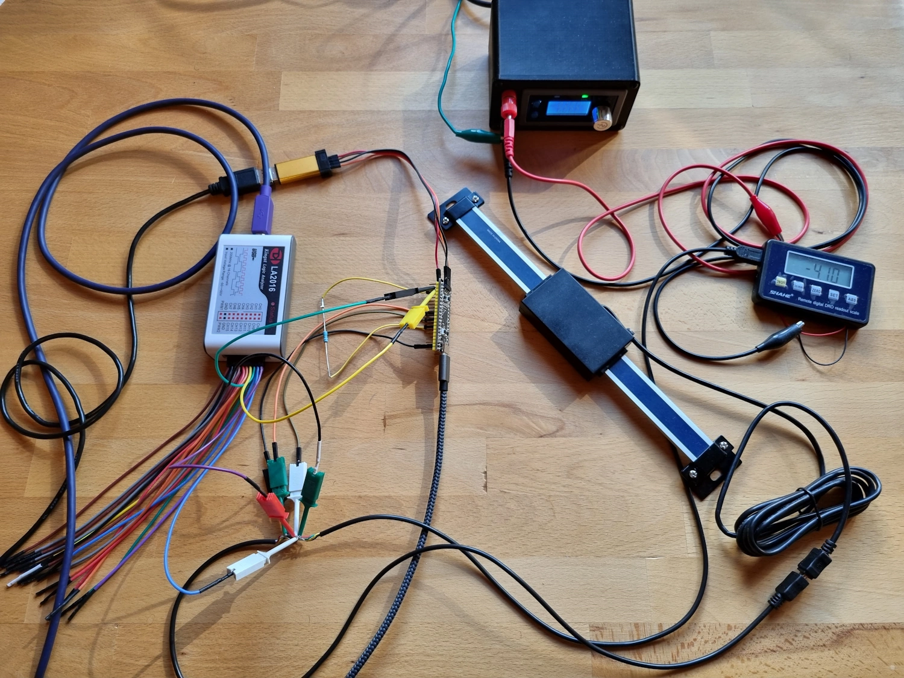
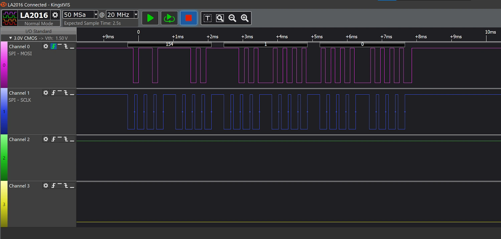
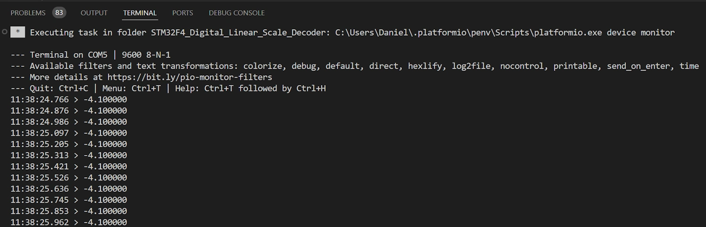

# STM32F411_Digital_Linear_Scale_Decoder
Decoder for digital linear scale (Shahe SH2205A0633). Position values are converted to mm and displayed via serial USB prints.  





### Folder Structure
```
--STM32F411CE_WeAct_Blackpill_USB_CDC_Serial
  |
  |--lib
  |  |
  |  |--usb_serial_lib
  |     |
  |     |- delay.c
  |     |- delay.h
  |     |- usb_serial.c
  |     |- usb_serial.h
  |     |- usbcdc.c
  |     |- usbcdc.h
  |
  |--src
  |   |
  |   |- main.c
  |
  |- platformio.ini
```

### Code Dependency
```
            [main.c]
               |
               +------------+
               |            |
         [usb_serial.*]     |
               |            |
               |            |
      +---------------------+
      |                     |
      |                     |
  [usbcdc.*]            [delay.*]
```

### Built With
* [PlatformIO IDE](https://platformio.org/platformio-ide) - IDE used for programming
* [libopencm3](https://github.com/libopencm3/libopencm3) - Open-source low-level hardware library for ARM Cortex-M microcontrollers

### Author
**Daniel Duller** - [dadul96](https://github.com/dadul96)

### License
This project is licensed under the GPL-3.0 License - see the [LICENSE](LICENSE) file for details

### Based on my existing USB CDC serial project for the STM32F411CE WeAct Blackpill Board:
[STM32F411CE_WeAct_Blackpill_USB_CDC_Serial](https://github.com/dadul96/STM32F411CE_WeAct_Blackpill_USB_CDC_Serial)

